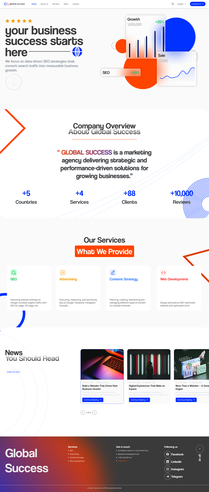
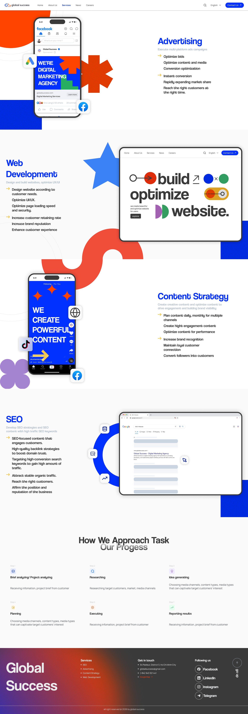
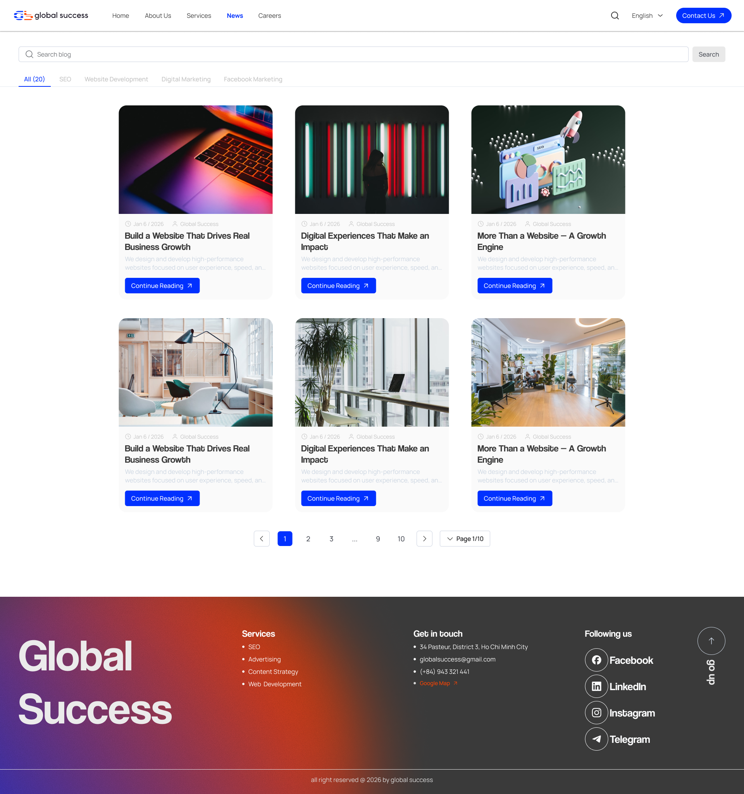
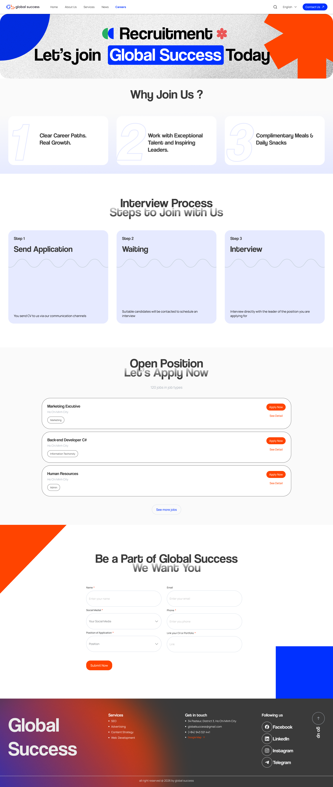
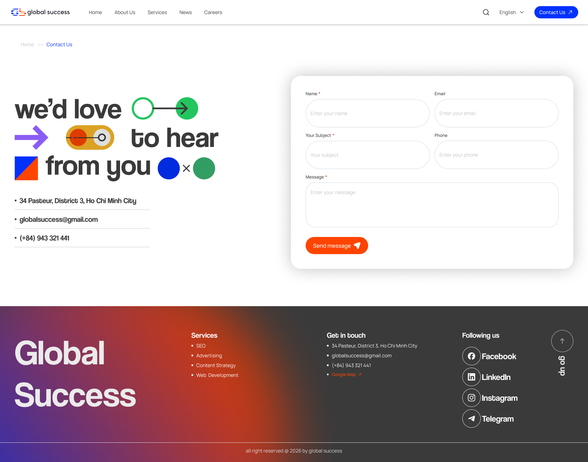

# Global Success — Marketing Agency Website

**GLOBAL SUCCESS** is a strategic marketing agency delivering performance-driven solutions for growing businesses across multiple countries.

---

## 🏠 Website Preview

### Home


### About Us


### Services


### News


### Careers


### Contact


---

## 🎯 About Global Success

| Metric | Value |
|--------|-------|
| Countries | 5+ |
| Services | 4+ |
| Clients | 8+ |
| Reviews | 10,000+ |

---

## 🚀 Services

- **SEO** — On-page, off-page optimization and full SEO strategy
- **Advertising** — Google Ads, Facebook Ads, Instagram, YouTube
- **Content Strategy** — Blog, social media, video, multi-channel distribution
- **Web Development** — UX/UI design, performance optimization, responsive builds

---

## 📋 Tech Stack

- **CMS:** WordPress 6.4+
- **Theme:** Flatsome v3.20.2
- **PHP:** 7.4+
- **WooCommerce:** 8.3+
- **Frontend:** HTML5, CSS3, JavaScript

---

## 🛠️ Installation

See the full step-by-step guide at **[INSTALLATION_GUIDE.md](./INSTALLATION_GUIDE.md)**

1. Install WordPress and activate the Flatsome theme
2. Import data using WP All In One Importer
3. Configure menus, pages, and contact forms
4. Update company info and social media links

---

## 📦 Project Structure

```
├── assets/              # CSS, JS, images, fonts
├── inc/                 # Core PHP: admin, blocks, classes, widgets
├── template-parts/      # Reusable page components
├── languages/           # Translation files (30+ languages)
├── images/              # UI preview screenshots
├── page-*.php           # Custom page templates
└── functions.php        # Main configuration file
```

---

## 📄 Pages

| Page | Description |
|------|-------------|
| Home | Agency overview and key services |
| About Us | Company story and achievements |
| Services | Detailed service offerings |
| News | Blog and latest updates |
| Careers | Job openings and recruitment |
| Contact | Contact form and office location |

---

## 📞 Contact

**Address:** 34 Pasteur, District 3, Ho Chi Minh City  
**Email:** globalsuccess@gmail.com  
**Phone:** (+84) 943 321 441

[](https://facebook.com/globalsuccess)
[](https://linkedin.com/company/globalsuccess)
[](https://instagram.com/globalsuccess)

---

## 📝 License

Licensed under GPL v2 or later. See `license.txt` for full details.
